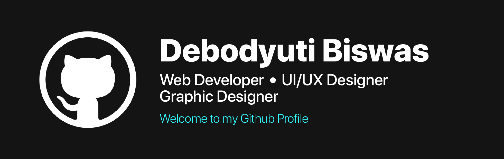

<h2>Hey there! I'm Aditya</h2>

<!-- ## 👋 &nbsp;Hey there! I'm Debodyuti -->

### 👨🏻‍💻 &nbsp;About Me

💡 &nbsp;I like to explore in Web Developement. I am also a UI/UX Designer.\
🎓 &nbsp;I'm currently studying Computer Science Engineering at the SRM Institute of Science and Technology.\
🌱 &nbsp;I'm on track for learning more about Developement and UI/UX.\
✍️ &nbsp;In my free time, I pursue Graphic Design and UI/UX Design as hobbies/side hustles.\
💬 &nbsp;Feel free to reach out to me for any collaborative work, would love to do that.\
✉️ &nbsp;You can shoot me an email at db8145@srmist.edu.in !\

### 🛠 &nbsp;Tech Stack

&nbsp;
&nbsp;
&nbsp;
&nbsp;
\
&nbsp;
&nbsp;
&nbsp;
&nbsp;
&nbsp;
&nbsp;
&nbsp;
&nbsp;
&nbsp;
&nbsp;

### ⚙️ &nbsp;GitHub Analytics

### 🤝🏻 &nbsp;Connect with Me

